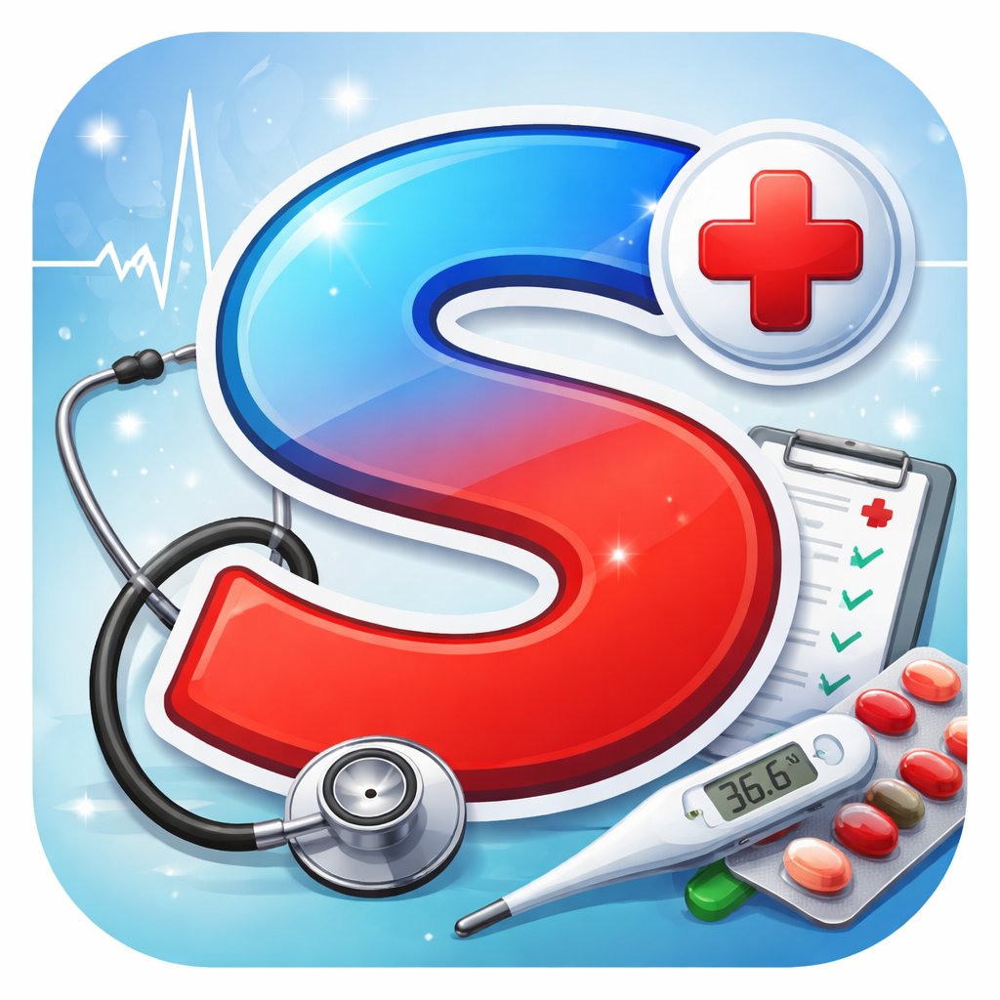

# 🩺 Sweat Health Dashboard (PWA)
*ระบบตรวจสุขภาพอัจฉริยะจากเหงื่อแบบเรียลไทม์*

## 📝 เกี่ยวกับโปรเจกต์ (About Project)
*Sweat Health Dashboard* เป็นแอปพลิเคชันเว็บในรูปแบบ *Progressive Web App (PWA)* ที่ออกแบบมาเพื่อทำงานร่วมกับเซนเซอร์ตรวจวัดสารเคมีในเหงื่อ พัฒนาขึ้นเพื่อช่วยให้นักกีฬาและผู้ที่ใส่ใจสุขภาพสามารถติดตามสภาวะร่างกายได้ทันทีโดยไม่ต้องเจาะเลือด

### ฟีเจอร์หลัก (Key Features)
* *Real-time Monitoring:* แสดงค่า Glucose, Lactate, Sodium และค่า pH จากเหงื่อแบบสดๆ
* *Hydration Tracking:* คำนวณระดับน้ำในร่างกาย (%) เพื่อป้องกันอาการขาดน้ำ
* *Interactive Chart:* กราฟแสดงแนวโน้มสุขภาพเพื่อให้ง่ายต่อการวิเคราะห์ข้อมูล
* *PWA Support:* สามารถติดตั้งลงบนสมาร์ทโฟน (iOS/Android) ได้เหมือนแอปทั่วไป
* *Responsive Design:* รองรับการแสดงผลทุกหน้าจอ ไม่ว่าจะเป็นคอมพิวเตอร์หรือมือถือ

---

## 🚀 เทคโนโลยีที่ใช้ (Technologies Used)
* *Frontend:* HTML5, CSS3 (Modern UI), JavaScript (ES6+)
* *Visualization:* [Chart.js](https://www.chartjs.org/) สำหรับการทำกราฟข้อมูลสุขภาพ
* *PWA:* Service Workers และ Web App Manifest สำหรับฟังก์ชัน Offline และการติดตั้งแอป
* *Deployment:* [GitHub Pages](https://pages.github.com/)

---

## 📱 การติดตั้งบนมือถือ (Installation)
โปรเจกต์นี้รองรับ PWA คุณสามารถติดตั้งได้ง่ายๆ:
1. เปิดบราวเซอร์ไปที่ลิงก์โปรเจกต์
2. *Android:* กดจุด 3 จุด (⋮) เลือก *"ติดตั้งแอป" (Install App)*
3. *iOS:* กดปุ่ม *แชร์ (Share)* เลือก *"เพิ่มไปยังหน้าจอโฮม" (Add to Home Screen)*

---

## 🛠️ วิธีการใช้งาน (Usage)
1. เชื่อมต่ออุปกรณ์ Sensor เข้ากับระบบ (ผ่าน API หรือ Bluetooth ในอนาคต)
2. กดปุ่ม *"อ่านค่า Sensor"* เพื่อดึงข้อมูลล่าสุด
3. ตรวจสอบค่าที่ได้จากหน้า Dashboard และกราฟวิเคราะห์

---

## 👤 พัฒนาโดย (Developed by)
* *ศิริชัย ซาฑี (Sirichai Chatee)*
* Grade 11 Student (M.5) - Thai Educational System
* *GitHub:* [forworkps007-prog](https://github.com/forworkps007-prog)

---

*"Innovation for Better Health"* 🩺✨
